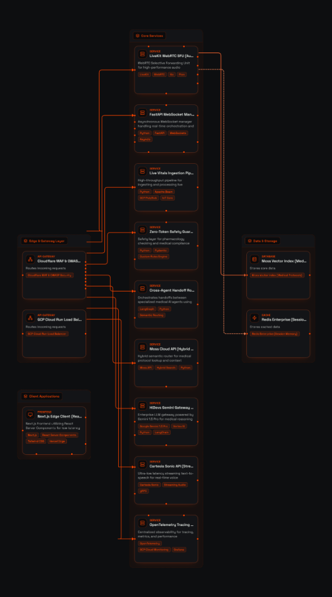

# Pulse Medical AI - Enterprise Architecture

Pulse utilizes a real-time, zero-latency microservices architecture built for scale, speed, and safety.

## System Architecture Diagram

## Mandatory Stack Compliance
- **Frontend**: Next.js (React Server Components for state management and UI)
- **Real-Time Streaming**: WebSockets & LiveKit implementation for sub-3s E2E voice latency.
- **Retrieval Engine**: Moss Python SDK for sub-10ms hybrid search protocols.
