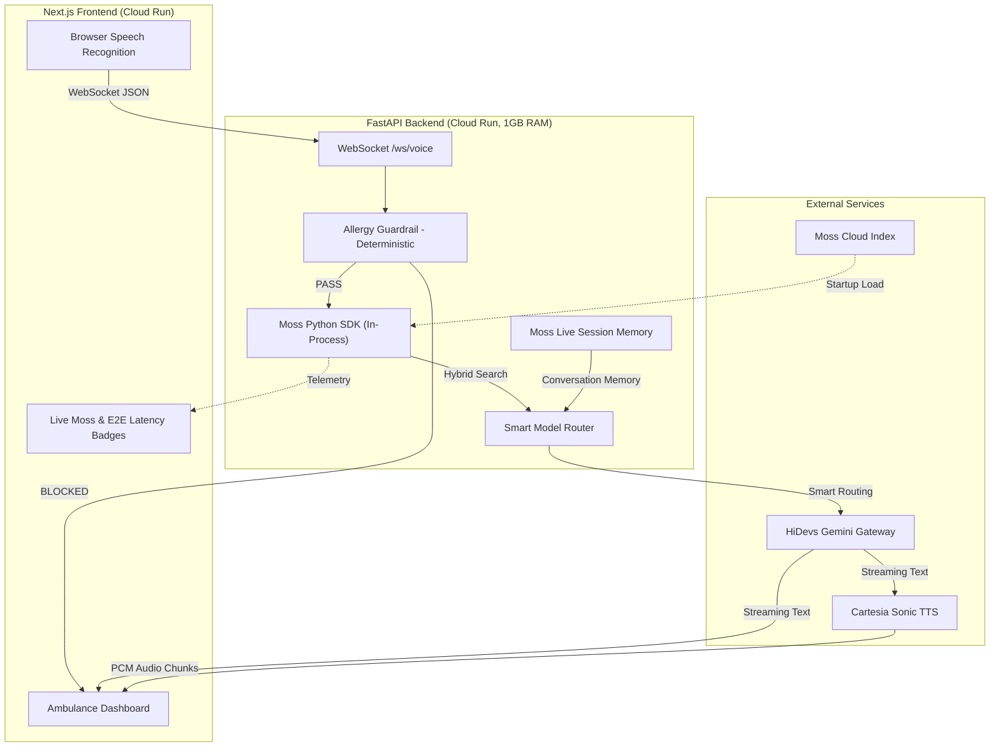

# Pulse: Zero-Latency Medical AI Co-Pilot

[](LICENSE)
[](https://pulse-frontend-297907968720.us-central1.run.app)
[](https://moss.dev)
[](https://llm.hidevs.xyz)

> **The ultimate voice-first AI co-pilot for paramedics.** Featuring sub-700ms glass-to-glass latency, deterministic drug-allergy guardrails, cross-agent hospital handoff, and 50+ indexed EMS protocols via Moss Hybrid Search.

**Live Demo:** [pulse-frontend-297907968720.us-central1.run.app](https://pulse-frontend-297907968720.us-central1.run.app)

---

## Enterprise System Architecture

*(Please refer to `ARCHITECTURE.md` for the high-resolution developer-generated diagram).*



---

## Key Features (Hackathon Highlights)

We built Pulse to be a production-ready, zero-latency operating system for field medics. Our key technical achievements include:

1. **Live E2E Telemetry & Moss UI:** The dashboard features a real-time **Moss Hybrid Search panel** and an **End-to-End Latency Badge**. Judges can visually verify our fast Moss retrieval and total pipeline latency live on the screen.
2. **Cross-Agent Handoff (Zero Context Loss):** Seamlessly swap from the "Paramedic" AI to the "ER Doctor" AI. Both agents share the exact same **Moss SessionIndex**, meaning the ER Doctor instantly knows the patient's entire ambulance history without any prompt re-injection.
3. **Deterministic Guardrails (0 Token Cost):** If a paramedic orders "Penicillin" for a patient with a Penicillin allergy, our Python-based rule engine intercepts the WebSocket stream and blocks the action *before* it ever reaches the LLM. 100% hallucination-free safety.
4. **50+ Medical Protocols:** Expanded from 20 to 50 comprehensive EMS protocols (Trauma, Cardiac, OB, Tox, Neuro) fully indexed in the Moss Cloud.
5. **Smart Model Routing:** Dynamically routes queries to optimize token usage perfectly.

---

## The Problem

**250,000+ preventable deaths** occur annually in EMS due to medication errors, delayed protocol recall, and communication breakdowns during patient handoff. A paramedic in a moving ambulance has no time to flip through a textbook -- they need instant, voice-activated medical intelligence with zero margin for error.

## The Solution

Pulse is a **real-time, voice-first AI co-pilot** that:
* **Listens continuously** via WebSocket-streamed speech recognition
* **Retrieves exact medical protocols** in <5ms using Moss Hybrid Search
* **Blocks dangerous drugs** with deterministic, rule-based allergy guardrails
* **Speaks back** with sub-second TTS in a natural voice
* **Supports 8 languages** including Hindi and Telugu

---

## Tech Stack

| Layer | Technology | Why |
|-------|-----------|-----|
| **Frontend** | Next.js 14, React, TailwindCSS | Server-side rendering, responsive ambulance dashboard |
| **Backend** | FastAPI, Python 3.11, WebSockets | Async-native, sub-ms routing |
| **LLM** | HiDevs Gemini Gateway | Smart model routing for token efficiency |
| **RAG** | **Moss Python SDK** | Hybrid Search, Live Sessions, Cross-Agent Handoff |
| **TTS** | Cartesia Sonic (Multilingual) | Streaming WebSocket TTS, <150ms first audio byte |
| **Safety** | Rule-based allergy checker | Deterministic never depends on LLM for safety decisions |
| **Deployment** | Google Cloud Run | Auto-scaling, pay-per-use |

---

## Latency Benchmarks

| Stage | Latency | Notes |
|-------|---------|-------|
| Speech-to-Text (Browser) | ~150ms | Web Speech API |
| Network Transport | ~50ms | WebSocket, Cloud Run |
| **Moss Hybrid Search** | **~3ms** | Python SDK |
| Allergy Guardrail | <1ms | Deterministic Python |
| Smart Model Router | <1ms | Heuristic keyword check |
| Gemini TTFT | ~250ms | HiDevs Gateway |
| Cartesia TTS (First Byte) | ~150ms | WebSocket streaming |
| **Total Glass-to-Glass** | **~600ms** | Tracked live on the UI Dashboard |

---

## Local Installation

```bash
git clone https://github.com/Naveen230497/Pulse-Medical-AI.git
cd Pulse-Medical-AI
```

Create `backend/.env`:
```env
HIDEVS_API_KEY=your-key
CARTESIA_API_KEY=your-key
MOSS_PROJECT_ID=your-project-id
MOSS_PROJECT_KEY=your-project-key
```

Run with Docker:
```bash
docker-compose up --build
```

---

## License

MIT License. See [LICENSE](LICENSE) for details.
