# 🚨 Pulse: Zero-Latency Medical AI Co-Pilot

[](LICENSE)
[](https://pulse-frontend-297907968720.us-central1.run.app)
[](https://moss.dev)
[](https://llm.hidevs.xyz)

> **Voice-first AI co-pilot for paramedics.** Sub-700ms glass-to-glass latency. Deterministic drug-allergy guardrails. Cross-agent hospital handoff. 20+ indexed EMS protocols via Moss Hybrid Search in under 5ms.

🔴 **Live Demo:** [pulse-frontend-297907968720.us-central1.run.app](https://pulse-frontend-297907968720.us-central1.run.app)

---

## 💀 The Problem

**250,000+ preventable deaths** occur annually in EMS due to medication errors, delayed protocol recall, and communication breakdowns during patient handoff. A paramedic in a moving ambulance has no time to flip through a textbook — they need instant, voice-activated medical intelligence with zero margin for error.

## 💡 The Solution

Pulse is a **real-time, voice-first AI co-pilot** that:

1. **Listens continuously** via WebSocket-streamed speech recognition
2. **Retrieves exact medical protocols** in <5ms using Moss Hybrid Search (in-process Python SDK)
3. **Blocks dangerous drugs** with deterministic, rule-based allergy guardrails (zero LLM dependency)
4. **Speaks back** with sub-second Cartesia Sonic TTS in natural voice
5. **Hands off seamlessly** to the ER Doctor AI with full Moss session memory — zero context loss
6. **Supports 8 languages** including Hindi and Telugu with browser-native TTS fallback

---

## 🏗️ System Architecture

```mermaid
graph TD
    subgraph Frontend["Next.js Frontend (Cloud Run)"]
        STT[Browser Speech Recognition]
        UI[Ambulance Dashboard]
        TelemetryUI[Moss Telemetry Panel]
    end

    subgraph Backend["FastAPI Backend (Cloud Run, 1GB RAM)"]
        WS[WebSocket /ws/voice]
        AG[Allergy Guardrail - Deterministic]
        SR[Smart Model Router]
        MossSDK["Moss Python SDK (In-Process)"]
        Session[Moss Live Session Memory]
    end

    subgraph External["External Services"]
        Gemini["HiDevs Gemini Gateway\n3.5-flash-lite | 3.5-flash | 3.6-flash"]
        Cartesia[Cartesia Sonic TTS]
        MossCloud[Moss Cloud Index]
    end

    STT -->|WebSocket JSON| WS
    WS --> AG
    AG -->|"❌ BLOCKED"| UI
    AG -->|"✅ PASS"| MossSDK
    MossSDK -->|"Hybrid Search α=0.7\n<5ms"| SR
    Session -->|"Conversation Memory"| SR
    SR -->|"Simple → flash-lite\nMedium → flash\nComplex → 3.6-flash"| Gemini
    Gemini -->|Streaming Text| Cartesia
    Gemini -->|Streaming Text| UI
    Cartesia -->|PCM Audio Chunks| UI
    MossSDK -.->|Telemetry| TelemetryUI
    MossCloud -.->|"Startup Load"| MossSDK
```



### Tech Stack

| Layer | Technology | Why |
|-------|-----------|-----|
| **Frontend** | Next.js 14, React, TailwindCSS | Server-side rendering, responsive ambulance dashboard |
| **Backend** | FastAPI, Python 3.11, WebSockets | Async-native, sub-ms routing |
| **LLM** | HiDevs Gemini Gateway (OpenAI SDK) | 3-tier smart model routing for token efficiency |
| **RAG** | **Moss Python SDK** (in-process) | Hybrid Search, Live Sessions, Cross-Agent Handoff |
| **TTS** | Cartesia Sonic (Multilingual) | Streaming WebSocket TTS, <150ms first audio byte |
| **Safety** | Rule-based allergy checker | Deterministic — never depends on LLM for safety decisions |
| **Deployment** | Google Cloud Run | Auto-scaling, pay-per-use |

---

## 🧠 Moss Integration Deep-Dive

Pulse uses the **Moss Python SDK** (`from moss import MossClient`) loaded in-process at server startup — NOT the CLI. This gives us **178x faster** protocol retrieval.

| Feature | Implementation | Benefit |
|---------|---------------|---------|
| **In-Process SDK** | `await moss_client.load_index("pulse-protocols")` at startup | 2-5ms queries vs 500ms CLI subprocess |
| **Hybrid Search** | `QueryOptions(alpha=0.7)` — 70% semantic, 30% keyword | Catches both exact drug names AND semantic medical concepts |
| **Live Session Memory** | `moss_client.session(index_name=f"call-{id}")` | Every conversation turn is indexed in real-time for context recall |
| **Cross-Agent Handoff** | Paramedic and ER Doctor share the same Moss SessionIndex | Zero context loss during patient handoff |
| **20 EMS Protocols** | Indexed via `moss_client.upsert()` with metadata | Covers cardiac, trauma, neuro, tox, peds, OB, environmental |

### Why Moss Over Alternatives?
- **Pinecone/Weaviate:** Require external API calls (100-300ms network latency). Moss runs in-process (<5ms).
- **ChromaDB:** No cloud sync, no session memory, no hybrid search.
- **LangChain RAG:** Heavy abstraction layer. Moss is a single import with native async.

📄 **Full Moss integration details:** [docs/MOSS_INTEGRATION.md](docs/MOSS_INTEGRATION.md)

---

## 🛡️ Safety Architecture

Pulse follows a **"deterministic-first"** safety model:

```
User speaks → Allergy Guardrail (Python, 0ms, 0 tokens) → Moss Protocol Search (5ms, 0 tokens) → LLM (only if safe)
```

The allergy checker uses:
- Forward drug-class mapping (Amoxicillin → Penicillin class)
- Reverse lookup (Penicillin allergy → blocks ALL penicillin-class drugs)
- Fuzzy phonetic matching via `difflib` (catches "Penicilin" misspellings)

**The LLM is NEVER in the safety-critical path.** If the guardrail fires, the LLM is never called.

---

## 🚀 Latency Benchmarks

| Stage | Latency | Notes |
|-------|---------|-------|
| Speech-to-Text (Browser) | ~150ms | Web Speech API |
| Network Transport | ~50ms | WebSocket, Cloud Run |
| **Moss Hybrid Search** | **~3ms** | In-process Python SDK |
| Allergy Guardrail | <1ms | Deterministic Python |
| Smart Model Router | <1ms | Heuristic keyword check |
| Gemini TTFT | ~250ms | HiDevs Gateway |
| Cartesia TTS (First Byte) | ~150ms | WebSocket streaming |
| **Total Glass-to-Glass** | **~600ms** | End-to-end |

---

## 🌐 Multi-Language Support

| Language | STT | LLM Response | TTS |
|----------|-----|-------------|-----|
| English | ✅ Browser API | ✅ Gemini | ✅ Cartesia Sonic |
| Hindi | ✅ Browser API | ✅ Gemini | ✅ Browser TTS Fallback |
| Telugu | ✅ Browser API | ✅ Gemini | ✅ Browser TTS Fallback |
| Spanish | ✅ Browser API | ✅ Gemini | ✅ Cartesia Sonic |
| French | ✅ Browser API | ✅ Gemini | ✅ Cartesia Sonic |
| German | ✅ Browser API | ✅ Gemini | ✅ Cartesia Sonic |
| Portuguese | ✅ Browser API | ✅ Gemini | ✅ Cartesia Sonic |
| Chinese | ✅ Browser API | ✅ Gemini | ✅ Cartesia Sonic |

---

## 🛠️ Local Installation

```bash
git clone https://github.com/Naveen230497/Pulse-Medical-AI.git
cd Pulse-Medical-AI
```

Create `backend/.env`:
```env
HIDEVS_API_KEY=your-key
CARTESIA_API_KEY=your-key
MOSS_PROJECT_ID=your-project-id
MOSS_PROJECT_KEY=your-project-key
```

Run with Docker:
```bash
docker-compose up --build
```

---

## 📄 Documentation

- [Product Requirements Document (PRD)](docs/PRD.md)
- [Moss Integration Deep-Dive](docs/MOSS_INTEGRATION.md)
- [Architecture & Data Flow](docs/ARCHITECTURE.md)

---

## 📝 License

MIT License. See [LICENSE](LICENSE) for details.
