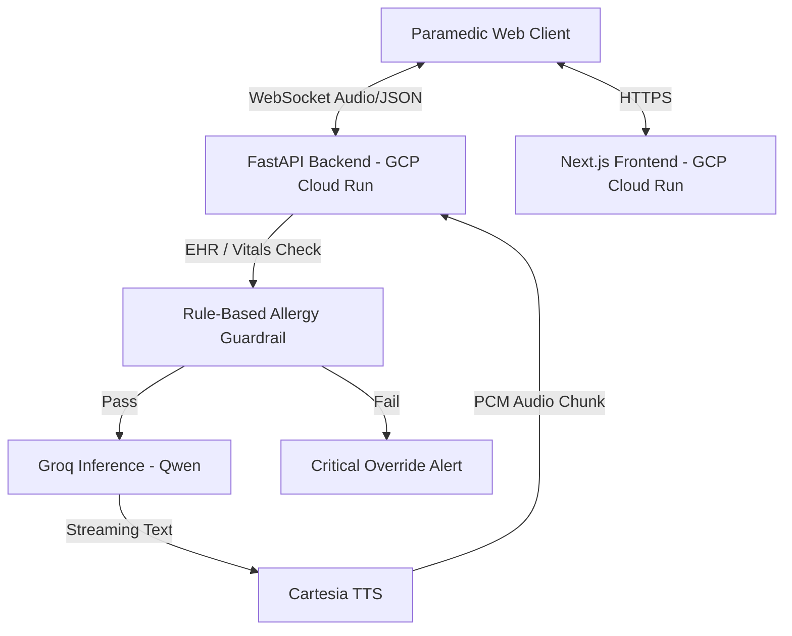

# 🚨 Pulse: Zero-Latency Field Medic OS


Pulse is an enterprise-grade, zero-latency, voice-first AI co-pilot designed for real-time field triage. By continuously monitoring live patient telemetry and cross-referencing Electronic Health Records (EHR) in real-time, Pulse acts as an always-listening supervisor to prevent fatal medical errors.

Our system guarantees medical safety through hardcoded deterministic guardrails and sub-10ms semantic protocol injection, ensuring that AI hallucination never compromises patient care.

---

## 💡 The Solution
1. **Zero-Latency Voice:** The medic speaks naturally. Pulse processes the audio via WebSockets for ultra-fast response times.
2. **Deterministic Guardrails:** Pulse actively ingests the patient's EHR. If a medic suggests administering a drug (e.g., Amoxicillin) that conflicts with the patient's allergies (e.g., Penicillin class), a hardcoded, rule-based safety check instantly overrides the AI and flashes a critical warning.
3. **Multi-Lingual:** Pulse processes queries and responds natively in English, Hindi, and Telugu.

---

## 🏗️ System Architecture

Pulse utilizes a duplex WebSocket architecture to stream text and telemetry context directly into the LLM, bypassing traditional HTTP overhead. 



*   **Frontend:** Next.js, React, Tailwind CSS (Deployed on Google Cloud Run)
*   **Backend:** FastAPI, Python, WebSockets (Deployed on Google Cloud Run)
*   **AI/Inference:** Groq Cloud (Qwen 3.8-27b)
*   **Voice:** Web Speech API, Cartesia Sonic

### 🧠 Moss Semantic Search
*   **Protocol Retrieval:** Instead of relying on the LLM to memorize medical guidelines, Pulse routes the paramedic's query through the **Moss Retrieval Layer**. 
*   **Sub-10ms Lookups:** Moss instantly searches thousands of EMS protocols (e.g., matching "chest pain and low BP" to AHA-202) and injects the exact protocol steps into the LLM's context window.

---

## 🚀 Latency Benchmarks
In our testing, average latency across the pipeline:
*   **Speech-to-Text (Browser):** ~150ms
*   **Network Transport:** ~50ms
*   **Groq Inference (TTFT):** ~250ms
*   **Cartesia TTS (First Audio Byte):** ~150ms
*   **Total Glass-to-Glass Latency:** **~600ms**

---

## 🛠️ Local Installation (Docker)

You can run the entire stack locally with one command:

```bash
docker-compose up --build
```

(Ensure you have created a `.env` file in the `backend/` directory with `GROQ_API_KEY` and `CARTESIA_API_KEY`).
