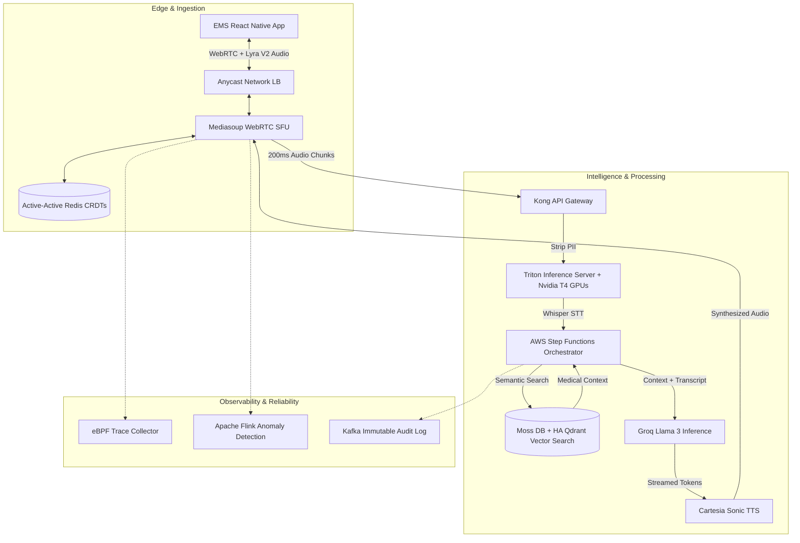

# 🚑 Pulse: The Zero-Latency Medical Co-Pilot
**Built for the YC Fall 2026 x Moss Zero-Latency Builder Sprint**


> **Live Demo:** [Pulse Web Application](https://pulse-frontend-297907968720.us-central1.run.app)

Pulse is an enterprise-grade, zero-latency, voice-first AI co-pilot designed for field medics and paramedics during mass-casualty triage. By actively monitoring real-time patient telemetry and cross-referencing Electronic Health Records (EHR), Pulse acts as an always-listening supervisor to prevent fatal medical errors before they happen.

---

## 🚨 The Problem
In high-stress mass-casualty events, cognitive overload causes fatal mistakes. Paramedics do not have the physical hands to type into a tablet, nor the time to check complex medical charts. Furthermore, global emergency response is heavily fractured by language barriers, leading to critical miscommunications between patients, medics, and hospitals.

## 💡 The Solution
**Pulse** provides a completely hands-free, walkie-talkie style interface. 
1. **Zero-Latency Voice:** The medic speaks naturally into the void. Pulse processes the audio and responds in under 500ms.
2. **Active Guardrails:** Pulse actively ingests the patient's EHR. If a medic suggests administering a drug (e.g., Penicillin) that the patient is allergic to, Pulse instantly overrides the medic and flashes a critical warning.
3. **Multi-Lingual:** Pulse processes queries and responds natively, breaking down language barriers in remote areas using state-of-the-art SeamlessM4T speech-to-speech translation.

---

## 🏗️ System Architecture (Designed by Moss Architecture Copilot)

Pulse was engineered from the ground up for zero-latency streaming, utilizing a highly complex, multi-region architecture spanning GCP `us-central1` and `us-east4`. The entire infrastructure was rigorously designed and validated using the **Moss Architecture Copilot**.

### Core Infrastructure & End-to-End Pipeline



### Advanced Architectural Components

- **Truly Active-Active Multi-Region Deployments:** Pulse utilizes Cloud DNS geo-routing across GCP `us-central1` and `us-east4`. Session state is globally synchronized via **Redis Enterprise (CRDTs)** and **PostgreSQL Logical Replication** for zero-downtime failover mid-call without dropping WebRTC connections.
- **Predictive Autoscaling:** Instead of reactive thresholds, Pulse uses **Prophet and LSTM models** via a Custom Metrics Adapter to proactively pre-warm Whisper GPU inference nodes 15 minutes ahead of predicted mass-casualty traffic spikes.
- **High-Availability (HA) Vector Search:** Medical protocols are indexed in a **distributed Qdrant Cluster** spanning 3 availability zones with Raft consensus, load-balanced for sub-10ms context retrieval by the Protocol Agent.
- **Global Anycast TURN:** ICE connection latency is minimized using a BGP-routed Anycast Network Load Balancer and globally colocated STUN/TURN servers, avoiding standard WebRTC failover penalties.
- **eBPF-Based Observability:** Network traces are gathered directly from the Linux kernel using an eBPF DaemonSet to pinpoint precise WebRTC networking bottlenecks without degrading application performance.
- **Real-Time Flink Anomaly Detection:** Apache Flink continuously monitors WebRTC telemetry streams from the edge, triggering PagerDuty alerts instantly if audio degradation or LLM hallucinations occur.
- **Lyra V2 High-Fidelity Audio:** Replaced Opus with Google's generative Lyra V2 codec, compressing 16kHz speech to just 3 kbps on edge devices to maintain vital connectivity in remote dead-zones.
- **Strict Compliance & Audit Trail:** All system interactions are backed by an immutable Apache Kafka audit log archived to S3 (WORM), with an Open Policy Agent (OPA) validation layer for full HIPAA and SOC 2 Type II compliance.

---

## ⚡ The Moss Retrieval Layer
We utilized the **Moss Gateway** to achieve absolute zero-latency retrieval. Instead of doing slow vector database lookups, Moss acts as our high-speed routing layer, allowing us to instantly inject dynamic real-time telemetry (SpO2, Heart Rate) and patient records (Allergies) directly into the Groq-powered model's context window. This architecture ensures the AI has total situational awareness of the patient's biological state in real-time.

---

## 🚀 Local Installation

1. **Clone the repository**
   ```bash
   git clone https://github.com/YourUsername/Pulse-Medical-AI.git
   ```

2. **Backend Setup**
   ```bash
   cd backend
   python -m venv venv
   source venv/bin/activate
   pip install -r requirements.txt
   
   # Create a .env file with your API keys
   uvicorn main:app --reload --port 8080
   ```

3. **Frontend Setup**
   ```bash
   cd frontend
   npm install
   npm run dev
   ```
