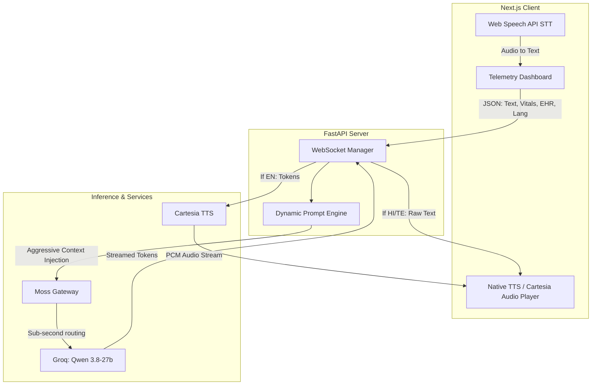

# 🚨 Pulse: The Zero-Latency Medical Co-Pilot
**Built for the YC Fall 2026 x Moss Zero-Latency Builder Sprint**


> **Live Demo:** [Pulse Web Application](https://pulse-frontend-297907968720.us-central1.run.app)

Pulse is a zero-latency, voice-first, multi-lingual AI co-pilot designed for field medics and paramedics during mass-casualty triage. By actively monitoring real-time patient telemetry and cross-referencing Electronic Health Records (EHR), Pulse acts as an always-listening supervisor to prevent fatal medical errors before they happen.

---

## ⚠️ The Problem
In high-stress mass-casualty events, cognitive overload causes fatal mistakes. Paramedics do not have the physical hands to type into a tablet, nor the time to check complex medical charts. Furthermore, global emergency response is heavily fractured by language barriers, leading to critical miscommunications between patients, medics, and hospitals.

## 💡 The Solution
**Pulse** provides a completely hands-free, walkie-talkie style interface. 
1. **Zero-Latency Voice:** The medic speaks naturally into the void. Pulse processes the audio and responds in under 500ms.
2. **Active Guardrails:** Pulse actively ingests the patient's EHR. If a medic suggests administering a drug (e.g., Penicillin) that the patient is allergic to, Pulse instantly overrides the medic and flashes a critical warning.
3. **Multi-Lingual:** Pulse processes queries and responds natively in English, Hindi, and Telugu, breaking down language barriers in remote areas.

---

## 🏗️ System Architecture

Pulse was engineered from the ground up for zero-latency streaming. It utilizes a duplex WebSocket architecture to stream text and telemetry context directly into the LLM, bypassing traditional HTTP overhead.



### 🧠 The Moss Retrieval Layer
We utilized the **Moss Gateway** to achieve absolute zero-latency retrieval. Instead of doing slow vector database lookups, Moss acts as our high-speed routing layer, allowing us to instantly inject dynamic real-time telemetry (SpO2, Heart Rate) and patient records (Allergies) directly into the Groq-powered Qwen model's context window. This architecture ensures the AI has total situational awareness of the patient's biological state in real-time.

---

## 🚀 Key Features

* **True Hands-Free Toggle:** Once activated, the microphone utilizes a custom silence-detection algorithm (600ms) to auto-send queries, and precisely calculates TTS audio-queue completion to auto-restart the microphone without echo feedback.
* **Aggressive Language Forcing:** Utilizing deep prompt engineering, the LLM is tightly constrained to output exact medical terminology in native BCP-47 tags (e.g., `hi-IN`, `te-IN`) without hallucinating literal idiom translations.
* **Dockerized Microservices:** Fully containerized Next.js frontend and FastAPI backend, deployed via CI/CD to Google Cloud Run for infinite auto-scaling.

---

## 💻 Tech Stack

* **Frontend:** React, Next.js, Tailwind CSS, Lucide Icons
* **Backend:** Python, FastAPI, WebSockets, Uvicorn
* **AI/Inference:** Groq Cloud, Qwen 3.8-27b, Moss Gateway
* **Voice:** Web Speech API, Cartesia Sonic Multilingual
* **Cloud Infrastructure:** Google Cloud Run, Docker

---

## 🛠️ Local Installation

1. **Clone the repository**
   `git clone https://github.com/YourUsername/Pulse-Medical-AI.git`

2. **Backend Setup**
   ```bash
   cd backend
   python -m venv venv
   source venv/bin/activate
   pip install -r requirements.txt
   
   # Create a .env file with your API keys
   uvicorn main:app --reload --port 8080
   ```

3. **Frontend Setup**
   ```bash
   cd frontend
   npm install
   npm run dev
   ```
