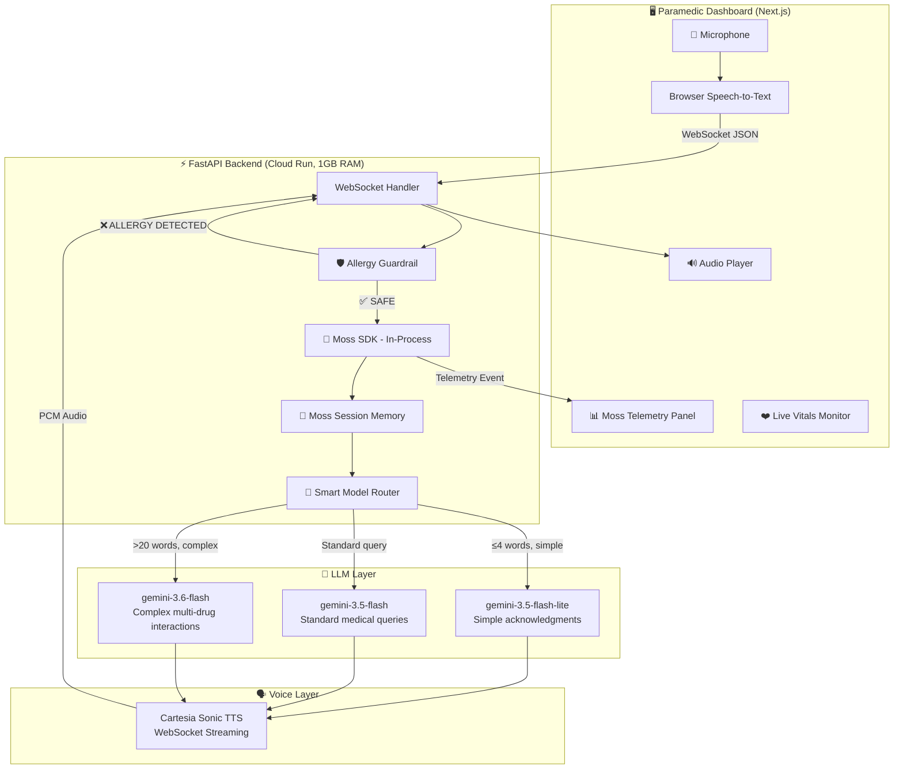
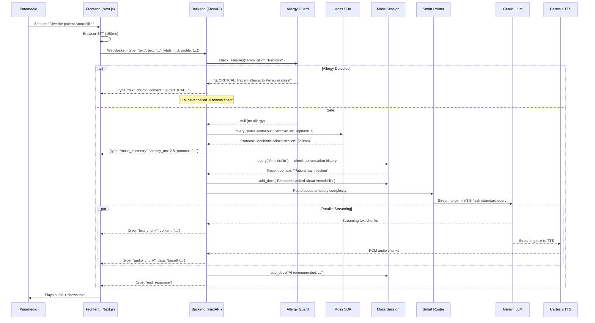
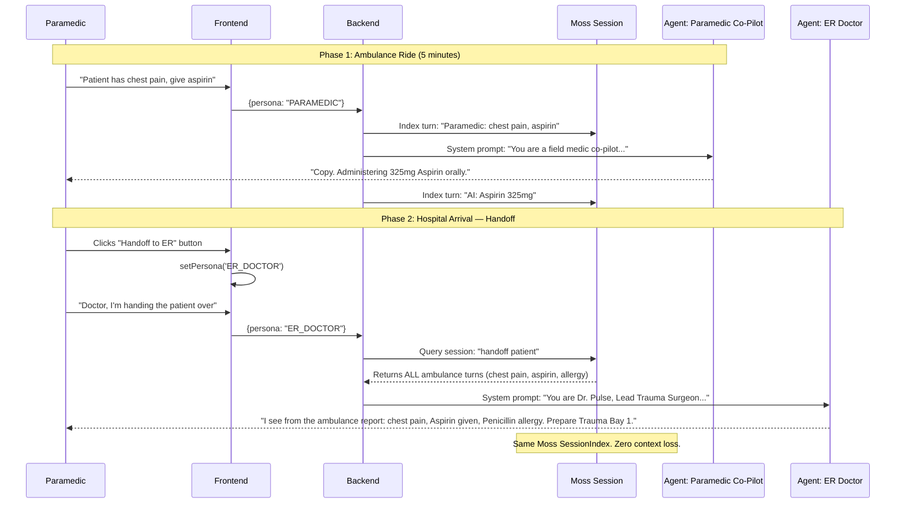
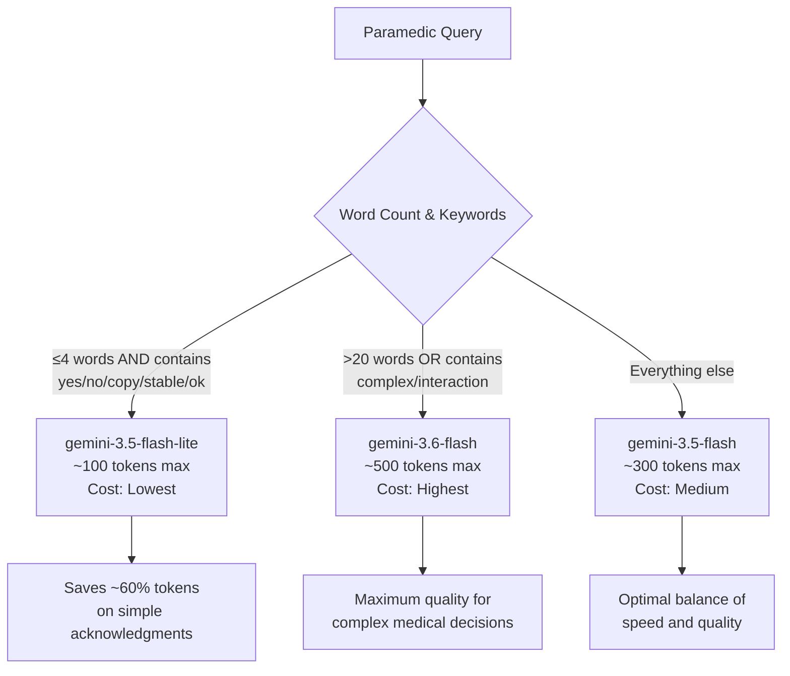
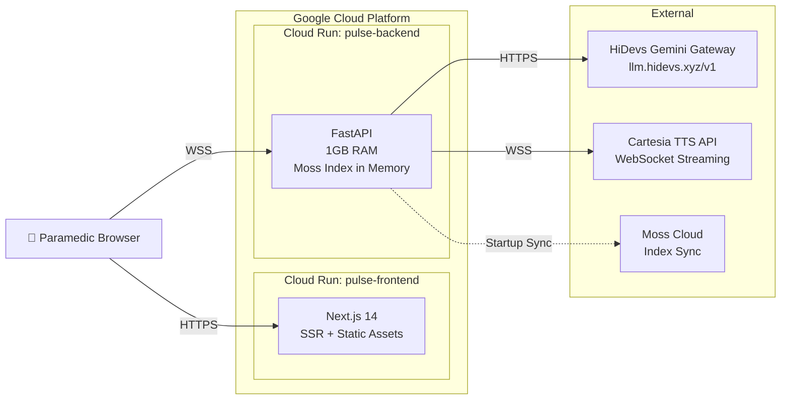

# Architecture & Data Flow

## High-Level System Architecture

---

## Single Request Lifecycle

---

## Cross-Agent Handoff Flow

---

## Smart Model Routing Logic

---

## Deployment Architecture

